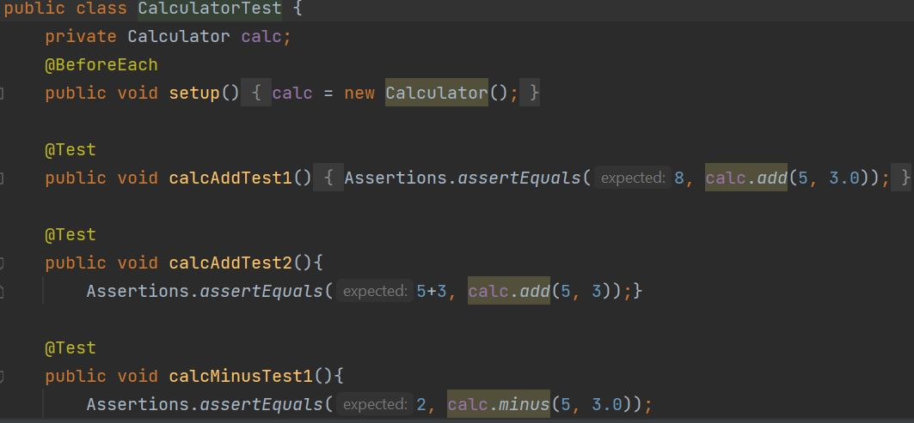
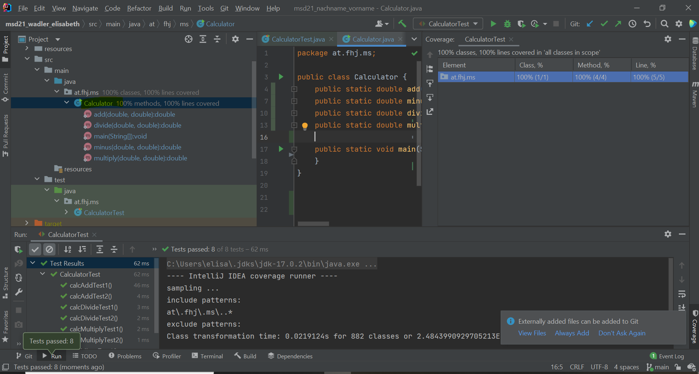

# JUnit Dokumentation

##Testcases

With the testmethods the functions add, minus, multiply and divide were checked.There are two testcases 
for every function. Firstly a calculator object is created an initialised. One compares a fixed value to the functions output(8, add(3,5))
and for the other the result will be calculated again (3+5, add(3,5)).

###Test coverage

